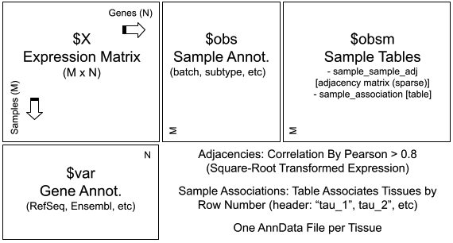

[← Back to Main](readme.md#import-and-structure-of-data-for-preffect)
# Import and Structure of Data for PREFFECT

## Set Input Path in __config.py_
The input path parameter `INPUT_ANNDATA_PATH` is set within the configuration file (_~/exp/4_preffect/\_config.py_). Input files are expected to be organized in AnnData structures, as described in [_Expected Input Data Structure_](#anndata_description).  


## Example Input for PREFFECT
Three small synthetic datsets are provided in AnnData format for learning purposes:
```
/preffect/
 ├── /vignettes/
      ├── /simple/ 
      ├── /single/
      ├── /full/
```

## Set Input for PREFFECT in `_config.py`
To set the 'simple' example data set as PREFFECT input, modify the `INPUT_ANNDATA_PATH` as follows:
```python
configs = {
  # Global Parameters
  ...  
  'INPUT_ANNDATA_PATH' : '/PREFFECT_PATH/exp/preffect/vignettes/simple/'
```
where '_PREFFECT_PATH_' is the location to your installation of PREFFECT. Setting up `_config.py` for training will be explained in more detail in [Training a PREFFECT model](training.md).

<a id="input_org"></a>

## Organization & Naming of AnnData Input Files

Data to be used for training, validation, and testing are expected to be within separate AnnData files found in subfolders within the `INPUT_ANNDATA_PATH` folder (_train_, _validation_ and _test_, respectively):

```
/path_to_input_folder/
│
├── train/
│   ├── anndata_training_data.tau_1.h5ad
│   ├── anndata_training_data.tau_2.h5ad (multi-tissue datasets only)
│
├── validation/
│   ├── anndata_validation_data.tau_1.h5ad
|   ├── anndata_validation_data.tau_2.h5ad
│
└── test/
    ├── anndata_test_data.tau_1.h5ad
    ├── anndata_test_data.tau_2.h5ad
```

Data for multiple tissues must be provided as separate AnnData files and placed in the same sub-folder. File names must include the suffix ".tau_#.h5ad", where # is an integer that is assigned to a particular tissue. The lowest integer is selected by PREFFECT as the "primary" tissue of interest (the other tissue(s) feed information into the network). Files without a suffix are ignored. 

Each AnnData matrix is expected to indexed by the identical set of $N$ genes (when performing tasks across multiple tissues, or between train/validation/test data sets). 


<a id="anndata_description"></a>
## Design of AnnData Tables
AnnData structures (Wolf et al., Genome Biology 2018) consist of an `X` expression matrix, an observation `obs` table that provides sample information, and a variables `var` table which describe each gene. PREFFECT expects the `var` table should include a _gene_ column consisting of HGNC gene symbols. `obs` typically includes clinical and technical variables, including 'batch' (necessary to perform batch correction with PREFFECT).

The overall data structure of an AnnData input file is summarized below:

<figure align="center">
  
  <figcaption>The Expected Data Structure of Input AnnData File(s)</figcaption>
</figure>

The additional tables within the `obsm` table (multi-dimensional annotation of observations) that are required when generating `single` and/or `full` PREFFECT models are described in the following subsections:
- [_Preparing transcript-transcript adjacency networks_](#preparing_adj)
- [_Preparing expression matrices for multiple tissues_](#preparing_assoc)

## Exploring Example AnnData
To help users better understand these input files, we will explore the contents of an example AnnData dataset. Users must first need to install the `anndata` or `scanpy` libraries. We will use `anndata` in this tutorial:
```bash
# install through pip
pip install anndata
# or through conda
conda install conda-forge::anndata
```

Then we load the sample data (in Python):
```python
import anndata as ad

# Load an AnnData file (we will use the 'single' example dataset provided)
single_data_file = '/PREFFECT_PATH/exp/preffect/vignettes/single/train/sim_single.train.tau_1.h5ad'

adata_single = ad.read_h5ad(single_data_file)
```

We can now explore the contents of its various tables.

```python
$ print(adata_single.X)

# X output (samples x genes)
[[  1  90   0 ...  16  98   0]
 [190   1   0 ...   0 190   0]
 [ 53   0   0 ...  73   0   0]
 ...
 [  0   0   0 ...  75   0   0]
 [ 14   0   0 ...   0   0   0]
 [  0   0 141 ...   0  19  15]]
```
```python
$ print(adata_single.obs) 
# obs output
|                | batch  |
|----------------|--------|
| tau1_0         | 1      |
| tau1_1         | 1      |
| tau1_2         | 2      |
| tau1_3         | 2      |
| ...            | ...    | 
```
```python
$ print(adata_single.var) 
# var output
# synthetic data includes mu/theta values used to populate gene counts
# these parameters are not required
| gene   | mu_batch1 | theta_batch1 | mu_batch2 | theta_batch2 |
|--------|-----------|--------------|-----------|--------------|
| Gene_1 | 10.338759 | 1            | 56.750773 | 1            |
| Gene_2 | 43.673077 | 1            | 60.125970 | 1            |
| Gene_3 | 38.212429 | 1            | 53.726516 | 1            |
| Gene_4 | 6.797485  | 1            | 44.607416 | 1            |
| ...    | ...       | ...          | ...       | ...         |
```
Exploration of the AnnData `obsm` tables is performed in the following two sections. 

<a id="preparing_adj"></a>
## Preparing transcript-transcript adjacency networks
PREFFECT allows users to provide an edge matrix which informs the network of sample-sample relations through an adjacency matrix. These are required when developing `single` or `full` PREFFECT models (not required for `simple` models).

The adjacency matrix is expected to be stored within `obsm` of each AnnData data file, and should be formatted as a [Compressed Sparse Column (CSC) matrix](https://docs.scipy.org/doc/scipy/reference/sparse.html): 

```python
$ print (adata_single.obsm['sample_sample_adj'])

# obsm sample-sample adjacency
(0, 0)	1
(1, 1)	1
(2, 2)	1
(3, 3)	1
(4, 3)	1
(40, 3)	1
...
```
Use of the adjacency matrix can be disabled by setting the "adj_exist" parameter to False within __config.py_. PREFFECT will terminate if `adj_exist` is set to True but no adjacency matrix is found within the input AnnData `obsm`.

We recommend forming the adjacency matrix by computing Pearson correlation from transformed (e.g. square root and mean trimming) count data. When designing PREFFECT, we set sample-sample correlations >= 0.8 as an edge (set to 1; all other entries set to 0). However, we encourage users to estimate interactions/edges in whatever manner they deem appropriate for their data set.

<a id="preparing_assoc"></a>
## Preparing expression matrices for multiple tissues
PREFFECT allows users to include data from multiple tissues to inform the network, where each data set is provided as a separate AnnData file within the same subfolder (see: "AnnData File Path and Naming"). PREFFECT does not assume $M$ samples are similarly ordered across raw expression matrices, as some tissues may not be matched. Instead, PREFFECT automates the reorganization of samples across tissues in order to align all `X` expression matrices. 

To do this, PREFFECT requires a sample association table for multi-tissue datasets, which is included in the `obsm` of each AnnData input file named _sample_association_. This table is expected to have a column for each tissue to be evaluated that relates samples together by their sample name.

Only the 'full' sample data will have the 'sample_associations' file.
```python
import anndata as ad

# Load an AnnData file (we will use the 'single' example dataset provided)
full_data_file = '/PREFFECT_PATH/exp/preffect/vignettes/full/train/sim_full.train.tau_1.h5ad'

adata_full = ad.read_h5ad(full_data_file)
```
```python
$ print(adata_full.obsm['sample_association'])
# obsm 'sample_association' output
|        | tau_1  | tau_2   |
|--------|--------|---------|
| tau1_0 | tau1_0 | tau2_0  |
| tau1_1 | tau1_1 | tau2_1  |
| tau1_2 | tau1_2 | tau2_2  |
| ...    | ...    | ...     |
```

This example 'sample_association' table is highly simplified. It contains no missing samples, and the names of matched samples are similar and easy to follow. This is not always the case in larger datasets.

Here is an example of a 'sample_association' table with missing data:
```python
# 'sample_association' for tau_1 AnnData file 
| sample name    | tau_1          | tau_2           | tau_3            |
|----------------|----------------|-----------------|------------------|
| tumour_1       | tumour_1       | normal_97       | tau_3_sample_147 |
| tau_1_sample_2 | tau_1_sample_2 | NaN             | tau_3_sample_71  |
| tau_1_sample_3 | tau_1_sample_3 | tau_2_sample_8  | NaN              |
| ...            | ...            | ...             | ...              | 
```

This table includes $(\tau)$ columns (e.g. $(\tau_1)$, $(\tau_2)$, $\ldots$), where the first column provides sample names in $X^{(\tau)}_{i, \cdot}$ order (for that particular AnnData structure, e.g. $(\tau_1)$), with each subsequent column providing the name of its matching pair in the separate AnnData structure (e.g. $(\tau_2)$). If a sample is unmatched (i.e. the sample had too poor QC to sequence), then $NaN$ should be entered in its place. 

Each tissue should have its own _sample_association_ table. AnnData requires that the number of rows for each table within `obsm` must equal to the number of samples in the `X` count matrix. The row order of _sample_association_ should also match the order of the AnnData structure it is being added to. If a particular sample was not sequenced in tissue $(\tau_1)$, then it will not appear in the $(\tau_1)$ _sample_association_ table. PREFFECT therefore requires that all input AnnData files have their own independent _sample_association_ table to have a record of every sample. 

The _sample_association_ table is used by PREFFECT to re-arrange the sample order of the expression tables (along with tables in \textit{obs} and \textit{obsm}) to ensure matched $M$ samples are identically ordered. 
A placeholder entry (which we colloquially call a "ghost" sample) is added to the $X^{(\tau)}_{i, \cdot}$ matrix with the average expression for each gene (where all metadata for this sample appears as $NaN$) to maintain its structure. These "ghost" samples are ignored when computing loss and accuracy measures. 


##
[← Back to Main](readme.md#import-and-structure-of-data-for-preffect)